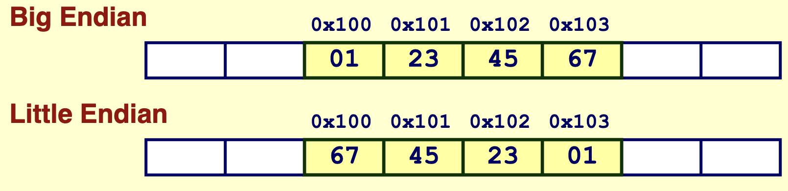
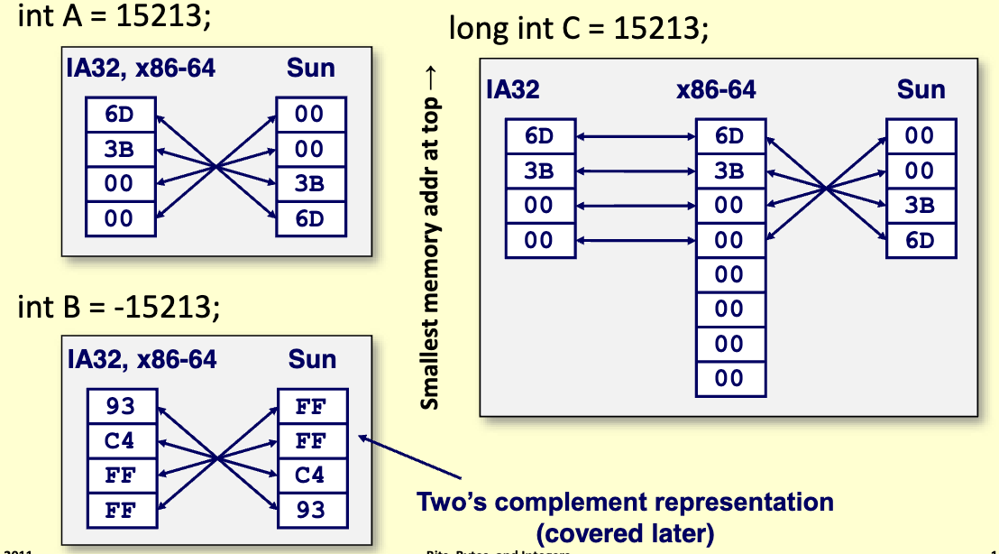
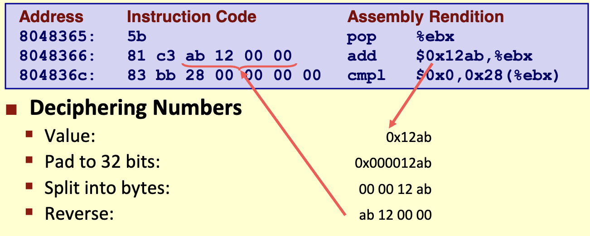
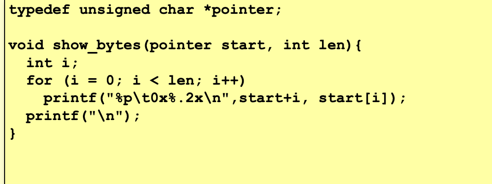
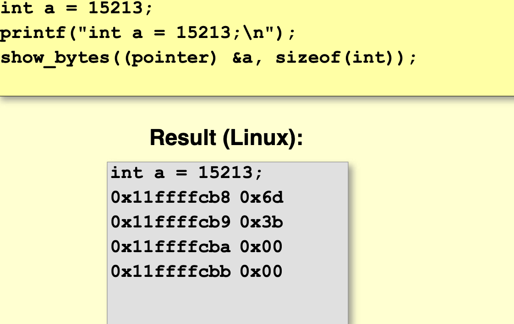

# Memory

- Pieces of an integer can bs spread out; they arent always directly next to each other in memory

## Endian

- 'Big Endian'
  - Least significant byte has *highest* address
- 'Little Endian'
  - Least significant byte has *lowest* address
- 
  - Address given by `&x` is `0x100`
- Left side is little endian, right side is big endian:
  - 

## Disassembly

- Text representation of binary machine code
- Generated by program that reads the machine code

## Examining Data Representation

- Printf can print pointers with %p and hexadecimals with %x
- 
- 
