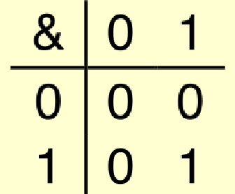
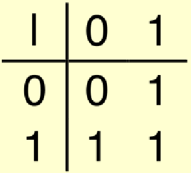
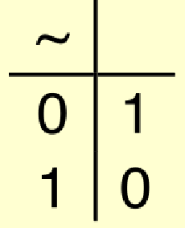
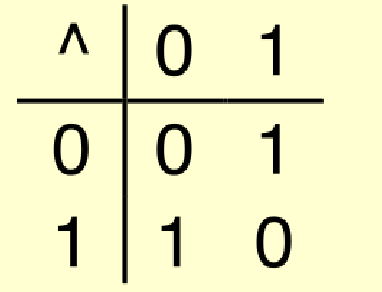
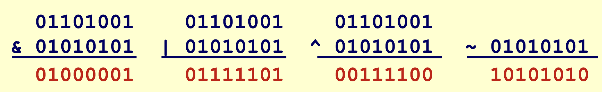
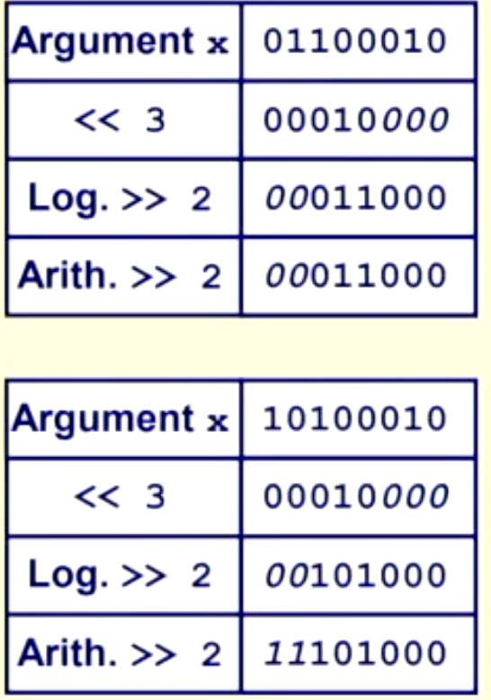

# Bit Manipulation

## Boolean Algebra

- True is 1 and False is 0
- Algebraic representation of logic

### And `&`

- A&B = 1 when both A=1 and B=1
- 

### Or `|`

- A|B = 1 when either A=1 or B=1
- 

### Not `~`

- ~A = 1 when A=0
- 

### Exclusive-Or (Xor) `^`

- A^B = 1 when either A=1 or B=1, but not both
- 

## Operations on Bit Vectors

- Operations are applied bitwise
- 

### Left Shift `x << y`

- Shift bit vector x left y positions
  - Throw away extra the sign and most significant bits, and zeros added to the right
- Fill with 0's on right

### Right Shift `x >> y`

- Shift bit-vector x right y positions
  - Throw away least significant bits and add new ones to left
- Arithmetic shift
  - Replace most significant bit on
    - 1011 >> 1 = 1101
    - 1011 >> 3 = 1111
    - 0011 >> 1 = 0001
    - 0011 >> 2 = 0000
- Logical shift
  - least-significant bit is thrown away, and a 0 is inserted on the other end
    - 1011 >> 1 = 0101
    - 1011 >> 3 = 0001

### Shift undefined behavior

- shift ammount <0 or >= word size
- diffrent machines behave differently
