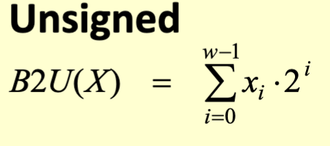
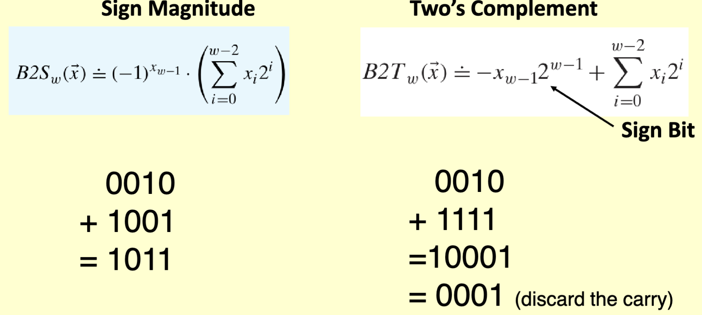
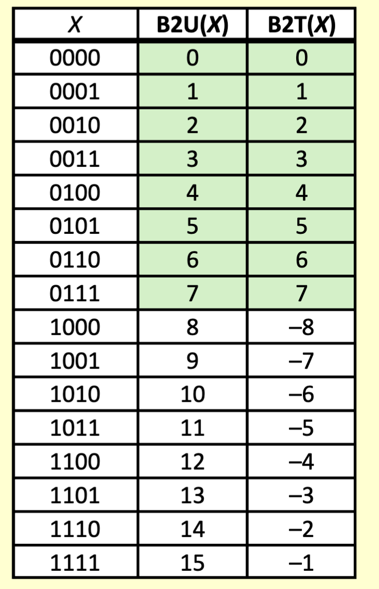
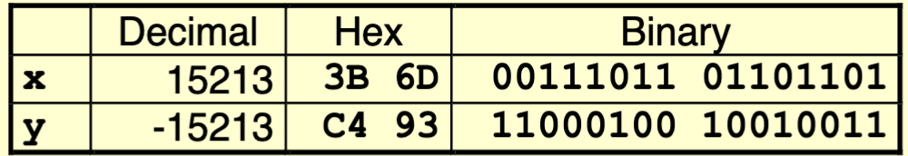
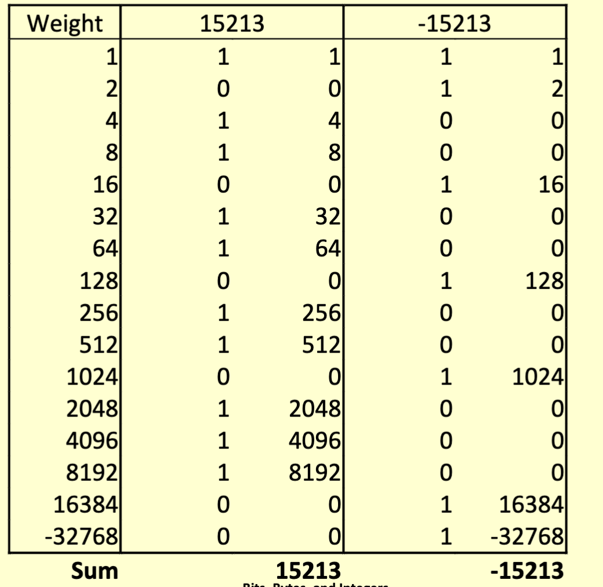
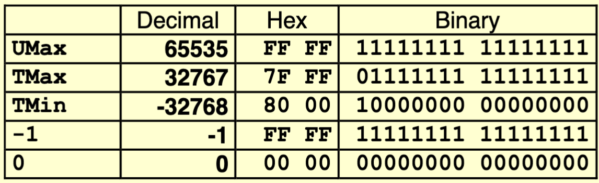
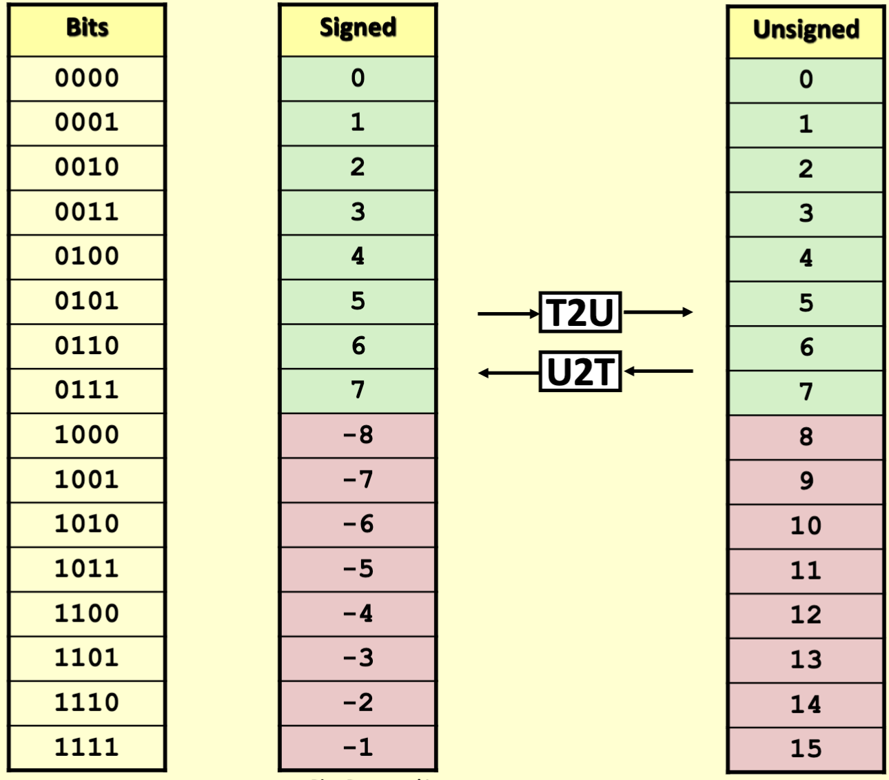

# Integers

## Encoding Integers

- 
  - If some power of 2 is set, add that power of 2.
- 
  - Sign magnitude is mathematically valid way, but we need to use Twos complement for computers

## Unsigned and signed numeric values

- Equivalence
  - Same encodings or nonnegative values
- Uniqueness
  - Every bit patern represents unique integer value
  - Each representable integer has unique bit encoding
- Can invert mappings
  - U2B(x) = B2U^(-1)(x)
    - (Unsigned 2 binary conversion)
    - Bit pattern for unsigned integer
  - T2B(x) = B2T^(-1)(x)
    - (twos complement 2 binary conversion)
    - Bit pattern for two's comp integer

## Sign bit

- most significant bit indicates sign
  - 0 for nonnegative
  - 1 for negative
- The sign bit simply adds a large negative power of two to get the desired number.
  - 
- For W=16
  - 
  - The minimum value is the sign bit.

## Conversion between signed and unsigned

  