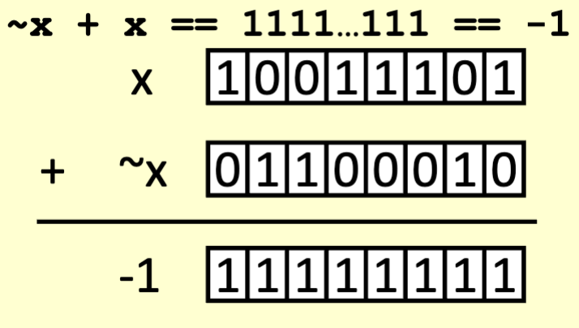
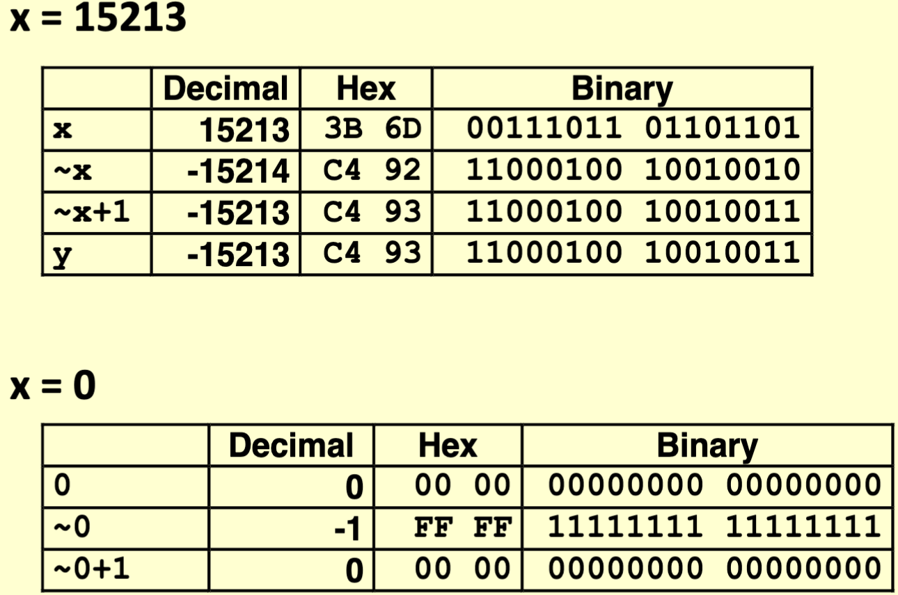
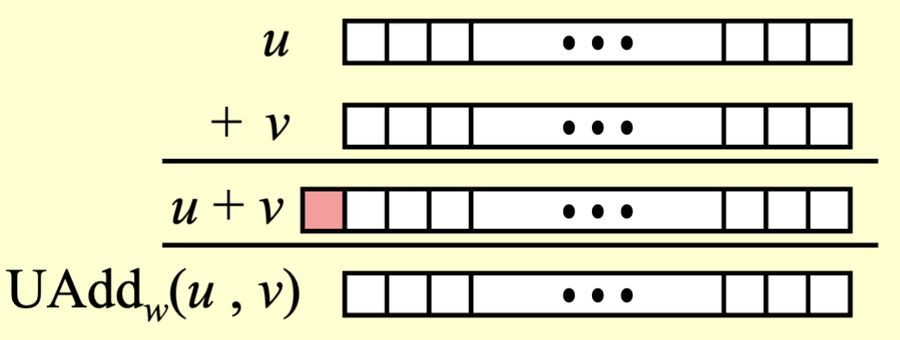
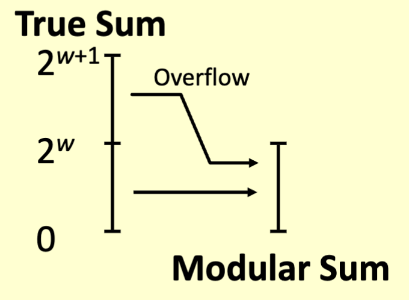
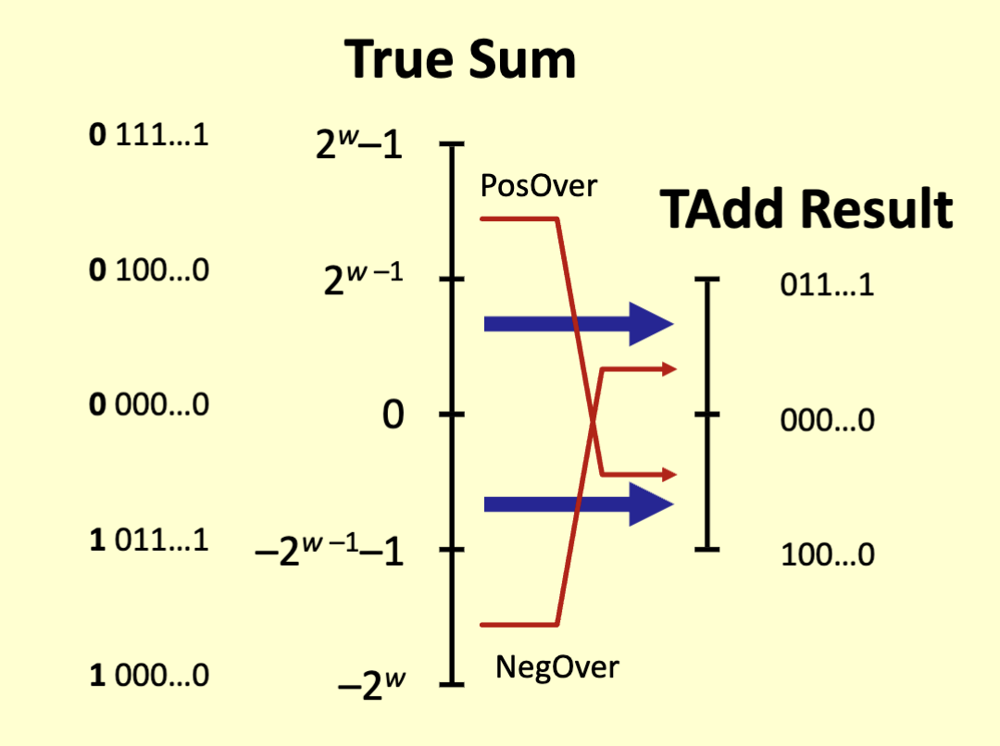
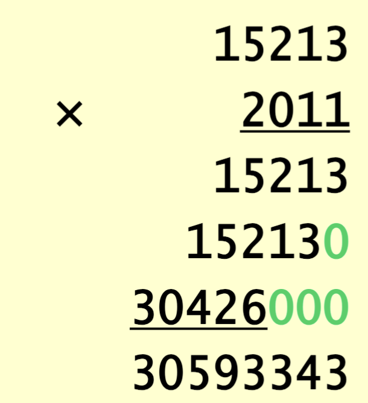
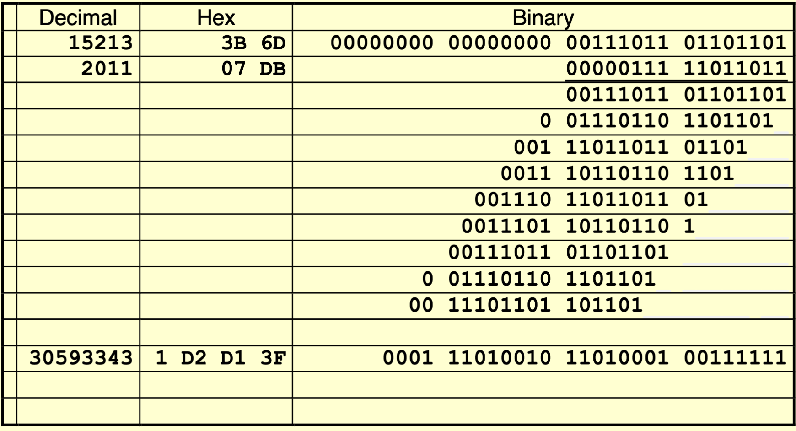

# Operations

## Negation

- ~x + 1 == -x
  - 
  - 

## Unsigned Addition

- Machines have limits, meaning we can have overflows
- Having some number of bits and adding a large value to it, may overflow the limit of bits we can hold.
  - Anything running off the end is thrown out.
    - If 32b integer is overflown, we would only be able to hold the 32b int limit.
  - 
  - 

## Signed Addition

- Overflows into the opposite sign
  - if sum >= 2^(w–1)
    - Becomes negative
    - At most once
  - If sum < –2^(w–1)
    - Becomes positive
    - At most once
- 

## Multiplication

- Multiplication is shifting and adding
- 
- 
