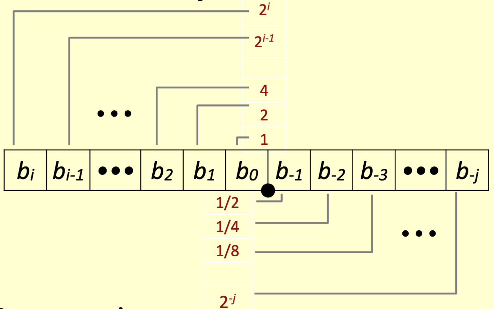
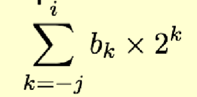
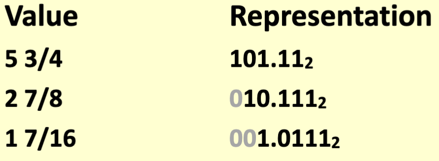
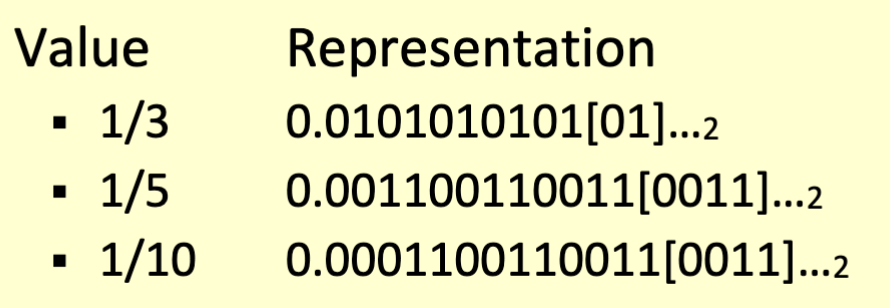
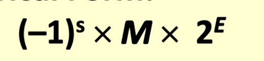
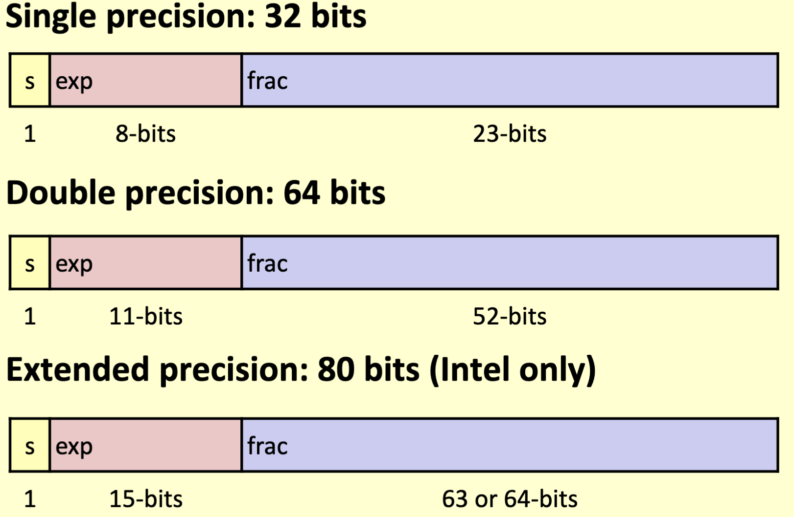
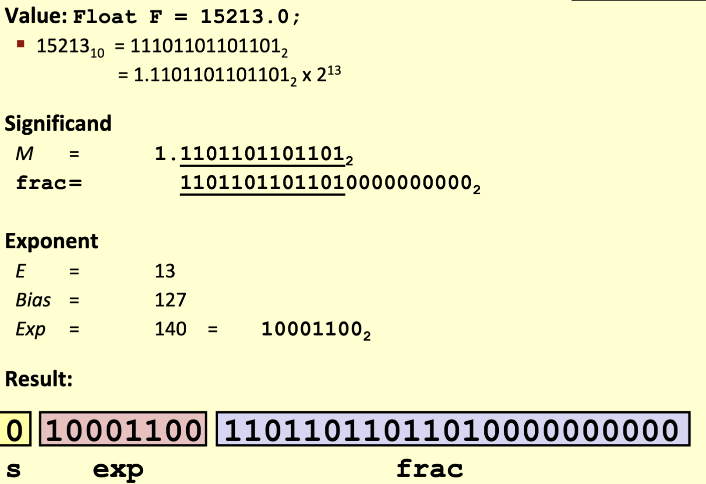
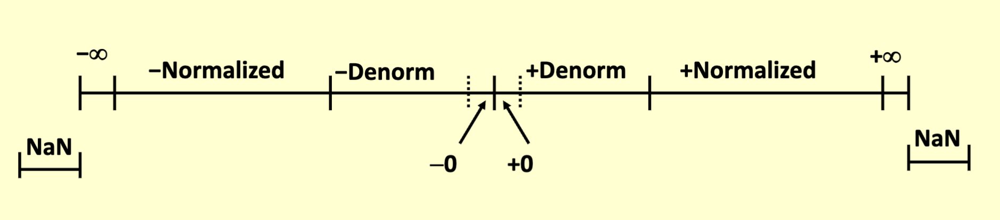

# Floating Point

## Fractional Binary Numbers - deprecated

- bits to the right ofthe 'binary point' represent fractional powers of 2
- represents a rational number:
  - 
- 
  - Divide by 2 by shifting right
  - Multiply by 2 by shifting left
  - numbers of form 0.1111.... are just below 1.0
    - 1/2 + 1/4 + 1/8 + ... | 1/(2^i) -> 1.0
    - Use notation 1.0 - e

### Limitations

- Repetition
  - Can only exactly represent numbers of the form x/(2^k)
  - Other rational numbers have repeating bit representations
  - 
- Precision
  - A large quantity of bits are necessary for very large or small numbers with fixed binary point
  - Numbers such as Planck's constant (-6.626068 x 10^(-34)) and Avogadro number (-6.022 x 10^(23)) were difficult to accurately represent
  
## What is a floating point?

- IEEE Standard 754
- A way to *approximate* real numbers in computers
  - Represents most rational numbers as well

### Numerical Form

- 
  - **Sign bit** s determines whether number is negative or positive
  - **Significand** M normally a fractional value in range [1.0, 2.0)
  - **Exponent** E weights value by power of two
- Encoding
  - MSB s is bit s
  - exp field encodes E (but is not equal to E)
  - frac field encodes M (but is not equal to M)
  - 

### Normalized Values

- Condition: exp =/= 000...0 and exp =/= 111...1
- Exponent coded as **biased** value: E = Exp - Bias
  - Exp unsigned vlaue exp
  - *Bias = 2^(k-1) - 1* where k is the number of exponent bits
    - Single precision: 127
    - Double precision 1023
- Significand coded with implied leading 1: M = 1.xx...x
  - xxx...x: bits of frac
  - Minimum when 000...0 (M = 1.0)
  - Maximum when 111...1 (M= 2.0 - e)

### Denormalized values

- Condition: exp = 000...0
- Exponent value: E = -Bias + 1 (instead of E = 0 - Bias)
- Significand coded with implied leading 0: M = 0.xxx...x
  - xxx...x: bits of frac
- Cases:
  - Exp = 000...0, frac = 000...0
    - Represents zero value
    - Distinct values for +0 and -0
  - exp = 000...0, frac =/= 000...0
    - Numbers very close to 0.0
    - Lose precision as get smaller
    - Equispaced

#### Special values

- Exp = 111...1, frac = 000...0
  - Represents the value of infinity
  - Operation that overflows
  - Both positive and negative
- Exp = 111...1, frac =/= 000...0
  - Not-a-number (NaN)
  - Represents case when no numeric value can be determined

