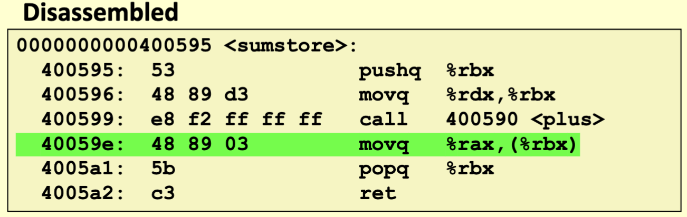
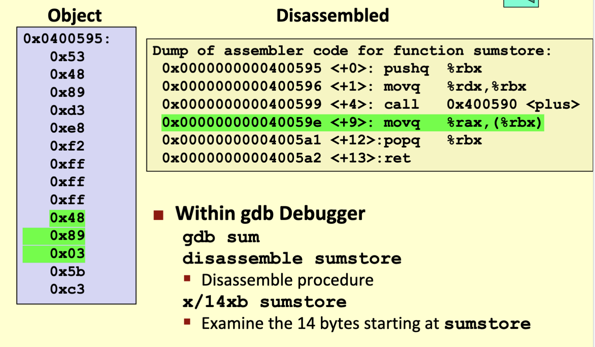

# Basics of Machine Level

## Basic terms

### Architecture

- Design of the computer
- **Instruction set architecture (ISA)**
  - The parts of a processor design that one needs to understand or write assembly/machine code
    - Also known as ISA
    - Specification of instruction formats, actions, registers, etc
  - Example ISAs:
    - Intel: x86, ia32, Itanium, x86-64
    - ARM: Used in most mobile phones, tablets, and growing into the consumer scene with apple silicon
- **Micro-architecture**: Implementation of the architecture
  - Cache sizes, core frequency

### Code Forms

- Machine Code: The byte-level programs that a processor executes
- Assembly code: A text representation of machine code

### Programmer-visible state

- PC: Program counter
  - Address of next instruction
  - Called "RIP" (x86-64)
- Register file
  - Heavily used program data
- Condition codes
  - Store status information about most recent arithmetic or logical operation
  - Used for conditional branching
- Memory
  - Byte addressable array
  - Code and user data
  - Stack to support procedures (aka functions)

### Von Neumann cycle

## Turning C into Object Code

- Code in files p1.c, p2.c
- Compile with command: gcc -og p1.c p2.c -o p
  - Use basic optimizations (-Og)
  - Puts resulting binary in file p
- 

## Assembly

### Compiling C into assembly

- Can be obtained with the command `gcc -Og -S sum.c`
  - `-Og` means optimize for debugging

### Data Types

- "Integer" data of 1, 2, 4, or 8 bytes
  - Data values
  - Addresses (untyped pointers)
- Floating point data of 4, 8, or 10 bytes
- Code: byte sequences encoding series of instructions
- No aggregate types such as arrays or structures
  - Just contiguously allocated bytes in memory

### Operations

- Move/copy data between memory and register
  - load data from memory into register
  - Store register data into memory
- Perform arithmetic or logical functions on register
- Transfer control
  - Unconditional jumps to/from procedures
  - Conditional branches

## Object code

- Assembler
  - Translated .s into .o
  - Binary encodings of each instruction
  - Nearly-complete image of executable code
  - Missing: linkages between code of different files
- Linker
  - Resolves references between files
  - combines with static run-time libraries
    - Ex: code for malloc, printf
  - Some libraries are dynamically linked
    - Linking occurs when program begins execution

## Machine Instruction Example

- C Code
  - `*dest = t;`
  - Store value t to memory designated by dest
- Assembly
  - `movq %rax, (%rbx)`
  - Move 8-byte value to memory
    - Quad words in x86-64 parlance
  - Operands
    - t:    Register %rax
    - Dest: Register %rbx
    - *dest Memory M[%rbx]
- Object Code
  - `0x40059e: 48 89 03`
  - 3-byte instruction
  - Stored in address 0x40059e

### Disassembling Object Code

- Disassembler
  - `objdump -d sum`
  - Userful tool for examining objecy code
  - Analyzes bit pattern of series of instructions
  - Produces approximate renditions of assembly code
  - Can dump either a.out file (complete executable) or .o (single module)

