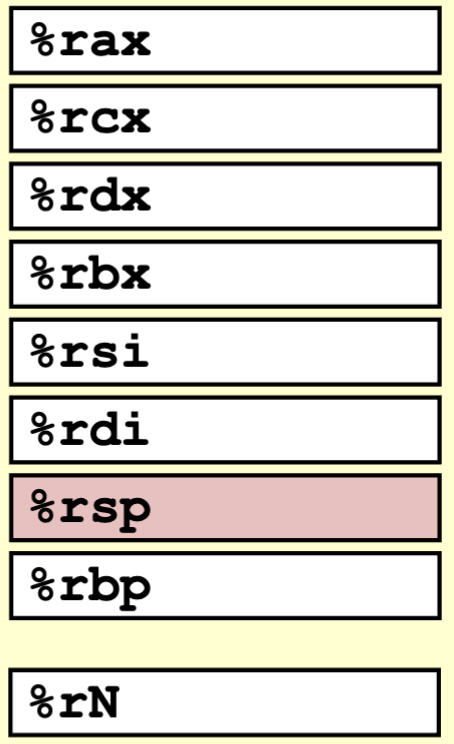
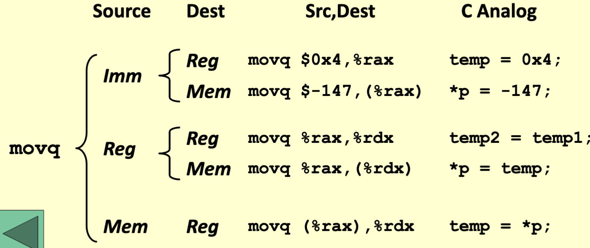

# registers and operations

## Moving Data

- `movq source, dest`
- Operand Types
  - Immediate: Constant integer data
    - Example: `$0x400, $-533`
    - Like a C constant, but prefixed with `$`
    - Encoded with 1, 2, or 4 bytes
  - Register: One of 16 integer registers
    - Example `%rax, %r13`
    - but `%rsp` reserved for special use
    - Others have special uses for particular instructions
  - Memory: 8 consecutive bytes of memory at address given by register
    - Simplest value (%rax)
    - Various other 'address modes'

- not possible to do memory-memory transfer with a single instruction