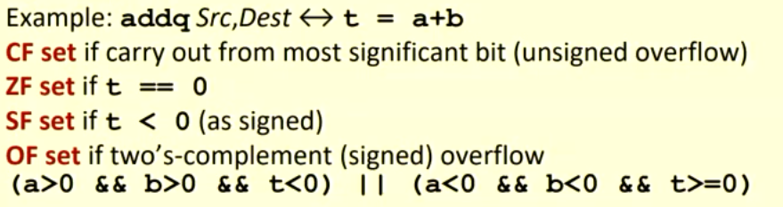
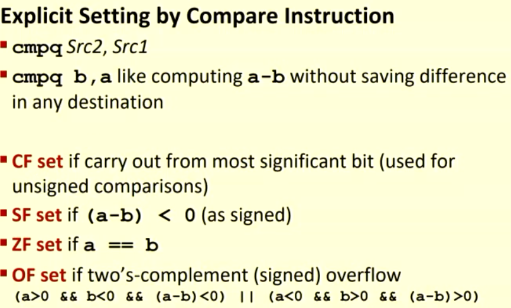
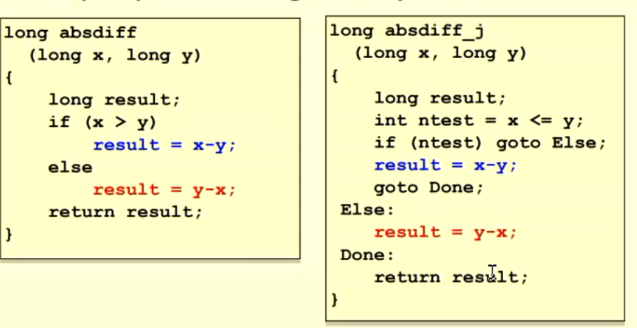

# Processor State

- Information about currenly execurting program
  - %rax
    - temporary data
  - %rsp
    - location of runtime stack
  - %rip
    - location of current code control point

## Condition Codes

- Status of recent tests

### Single bit registers

- CF
  - Carry flag (for unsigned)
- ZF
  - Zero Flag
- SF
  - Sign Flag (for signed)
- OF
  - Overflow Flag (for signed)

## Jumps

- jX instructions
- Jump to differnt part of code depending on condition codes

### expressing with Goto code

- C has goto statement
- jump to position designated by label
- effectively a representation of jumps

