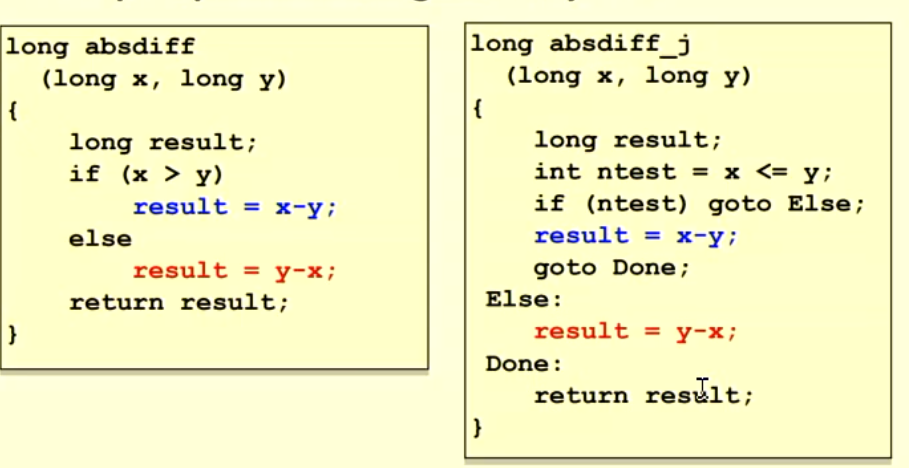

# Jumps and Loops

## Jumps

- jX instructions
- Jump to different part of code depending on condition codes

### expressing with Goto code

- C has goto statement
- jump to position designated by label
- effectively a representation of jumps

## Loops 

- use conditional branch to either continue looping or exit loop.

- for loops might be converted into while loops in certain compilers

## Switch statement

- multiple case labels
  - 5 & 6
- fall through cases:
  - 2
- missing cases:
  - 4

### Explanation

- Table structure
  - Each target requires 8 bytes
  - base address at .L4
- Jumping
  - Direct: jmp .L8
  - jump target is denoted by label .L8
  - Indirect: jmp *.L4(,%rdi,8)
  - start of jump table: .L4
  - Must scale by factor of 8 (Addresses are 8 bytes)
  - Fetch target from effective address .L4 + x*8
    - only for 0 <= x <= 6

## Jump table

