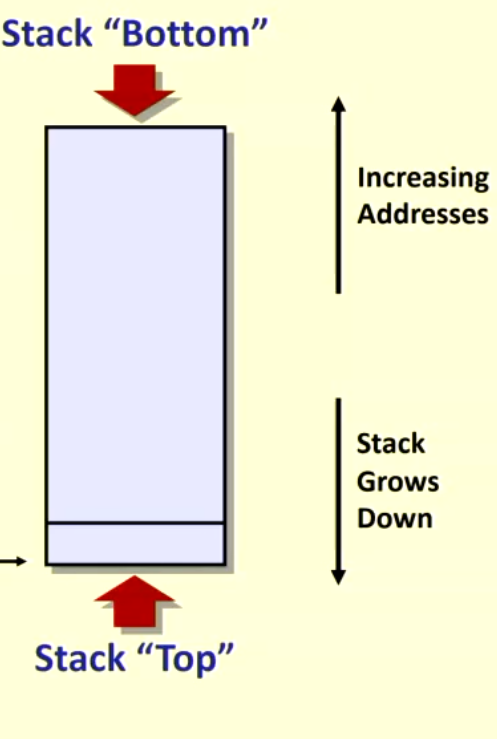
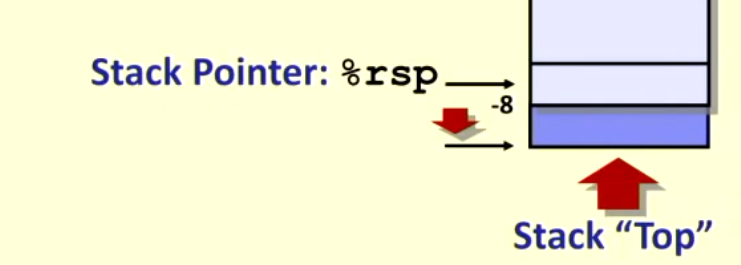
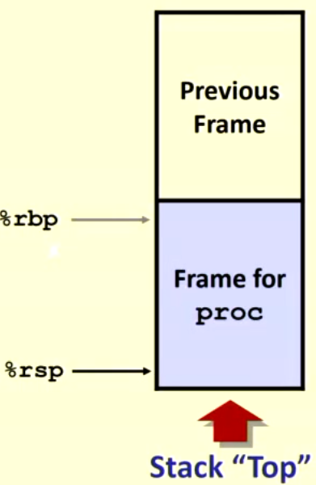

# Stack

## Stack Structure

- region of memory manged with stack discipline
  - Last in first out
  - grows down towards lower addresses
- Register %rsp contains lowest stack address
  - "top" element
  
### Push `pushq Src`

- fetch operand at Src
- decrement %rsp by 8
- Write operand at address given by %rsp

### Pop `popq Dest`

- Read value at address given by %rsp
- increment %rsp by 8
- Store value at Dest (must be register)

## Stack based languages

- Languages that support recursion
  - c, pascal, java
  - Code must be able to run multiple simultaneous instantiations of single function
  - needs some place to store state of each instance
    - arguments
    - local variables
    - return pointer
- Stack discipline
  - State for given function needed for limited time
    - from when called to once returned
- Stack allocated in frames
  - state for single function instance

## Stack frames

%rsp is stack pointer; %rbp is frame pointer

- Content
  - return information
  - local storage (if needed)
  - temporary space (if needed)
- Management
  - Space allowed when function call(ed)
    - "Set-up" code
    - includes push by `call` instruction
  - Deallocated when return
    - "finish" the code
    - includes pop by `ret` instruction

## Automatic Variable

- A variable declared inside a block or function body
- does not exist outside that block or function
- newly created upon entry to block of function
- does not retain its value across function calls or re-invocations or block.
