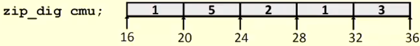
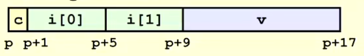

# Arrays

- A collection of objects of the same type stored contiguously in under one name
  - May be any type of object
  - May be objects of the same class (c++)
  - may even be collection of arrays o the same types
- Ease of access to any member of arrays
- For passing to functions as a collection

## Array Allocation

- Basic principle
  - T **A**[L]:
  - Array of data type T and length L
  - Contiguously Allocated region of L * sizeof(T) bytes in memory

## Array Accessing Example

- Register %rdi contains starting address of array
- Register %rsi contians array index
- Desired digit at %rdi + 4*%rsi
- Use memory reference of (%rdi, %rsi,4)

## Multidimensional (nested) Arrays

- Declaration
  - T **A**[R][C]
  - 2D array of data type T
  - R rows; C columns
  - Type T element requires K bytes
- Array Size
  - R \* C \* K bytes

## Structure Representation

- Structure represented as block of memory
  - Big enough to hold all of the fields
- Fields ordered according to declaration
  - Even if another ordering could yield a more compact representation
- Compiler determines overall size + positions of fields
  - Machine-level program has no understand of the structure in the source code

### Generating pointer for struct

- Generating Pointer to Array elements
  - Offset of each structure member determined at compile tome
  - computer as r + 4*idx

## Alignment

### Unaligned data

### Aligned Data

- Primitive data type requires K bytes
- Address must be multiple of K
- Required on some machines; advised on x86-64
- why is it good?
  - Memory accessed by aligned chunks of 4/8 bytes (system dependent)
    - Inefficient to load or store datum that spans quad word boundaries
    - Virtual memory trickier when datum spans 2 pages
- Compiler will insert gaps in structure to ensure correct alignment of fields
- Overall Alignment: (struct itself aligned with following struct)
  - For largest alignment requirement: Kf
  - overall structure must be multiple of K

### Specific Alignments (x86-64)

- 1 byte: char
  - no restrictions
- 2 bytes: short
  - lowest bit of address must be 0(2)
- 4 bytes: int, float, ...
  - lowest 2 bits of address must be 00(2)
- 8 bytes: double, long, char *,...
  - lowest 3 bits of address must be 000(2)
- 16 bytes: long, double (GCC on linux)
  - Lowest 4 bits of address must be 0000(2)
