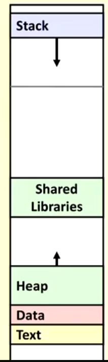
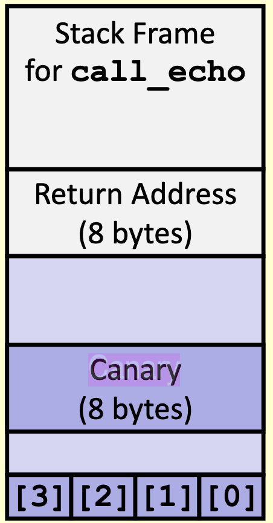
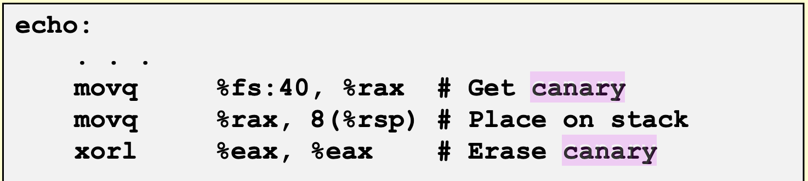
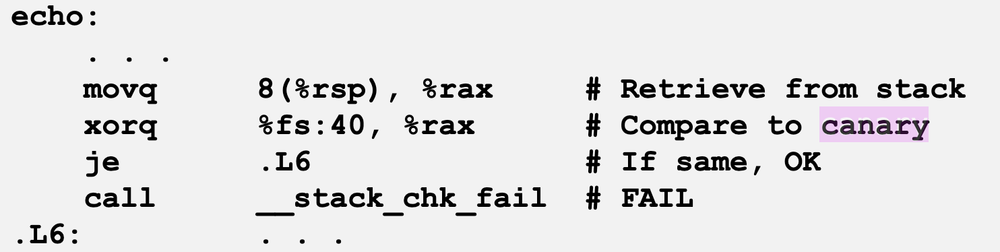

# Memory Layout

- Stack
  - Runtime stack (8MB limit)
  - contains local variables and other pertinent data
- Heap
  - Dynamically allocated as needed
  - when malloc, calloc, or new are called
- Data
  - Statically allocated data
  - global vars, static vars, string constants
- Text/shared libraries
  - Executable machine code
  - read only

## Buffer overflow

- Exceeding the memory size allocated for an array
- Most commonly caused by:
  - unchecked lengths on string inputs
    - `fgets` in c was implemented to solve this; has limited length
  - Unbounded character arrays on the stack
    - referred to as stack smashing
    - `strncpy` was implemented to avoid unchecked string lengths

## Canary

- Functions just as the 'canary in the coal mine'
- Canary is set at the beginning of a function and checked at the end

## Return-Orientated Programming Attack

