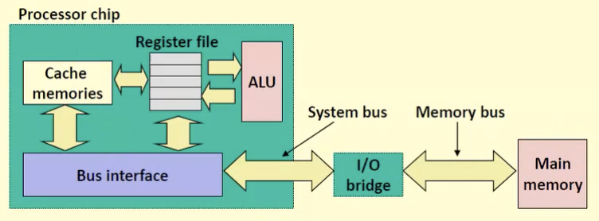
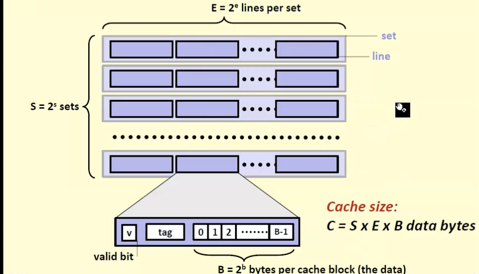

# Cache

## Cache memories

- Small, fast SRAM-based memories managed automatically in hardware
  - holds frequently accessed blocks of main memory
  - This is done to approximate the performance of fast memory while retaining size and economic benefits of larger, slower memory
- Processor loops first for data in caches (L1, L2, L3) then looks in main memory
- Typical structure:
  - 

## General Cache Structure

- Address of a word will have:
  - t bits of a tag
  - s bits of set index
  - b bits of block offset
